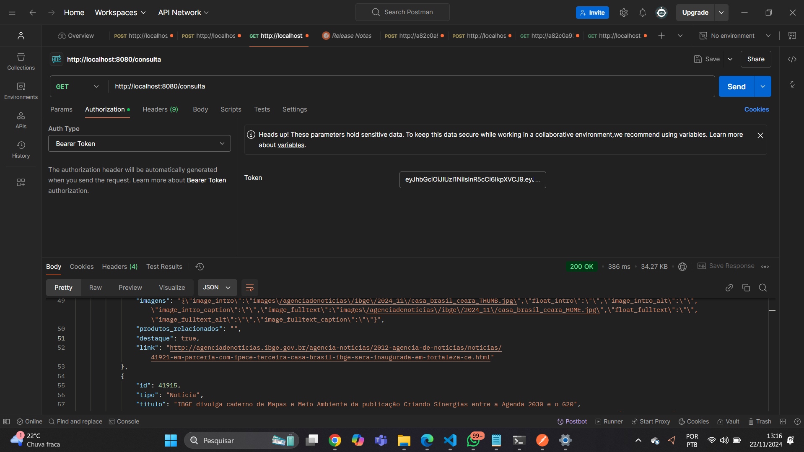

# Endpoint: GET /consultar

Permite consultar dados externos atualizados frequentemente. Este endpoint requer autenticação com um token JWT.

---

## **Requisição**

### **Método**
`GET`

### **URL**
`/consultar`

### **Cabeçalho**
```plaintext
Authorization: Bearer <JWT>
```

## **Resposta**
Retornará as notícias da API.

