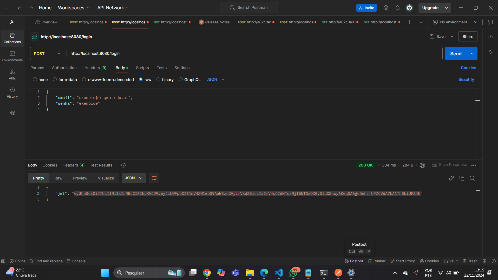

# Endpoint: POST /login

Autentica um usuário previamente registrado, validando as credenciais fornecidas e retornando um token JWT.
---

## **Requisição**

### **Método**
`POST`

### **URL**
`/login`

### **Cabeçalho**
Não é necessário nenhum cabeçalho adicional para este endpoint.

### **Exemplo de Payload**
```json
{
    "email": "HumbertoNuvem@insper.edu.br",
    "senha": "nuvem0"
}
```

## Resposta

A resposta será um json com um token de acesso usado para a consulta.

