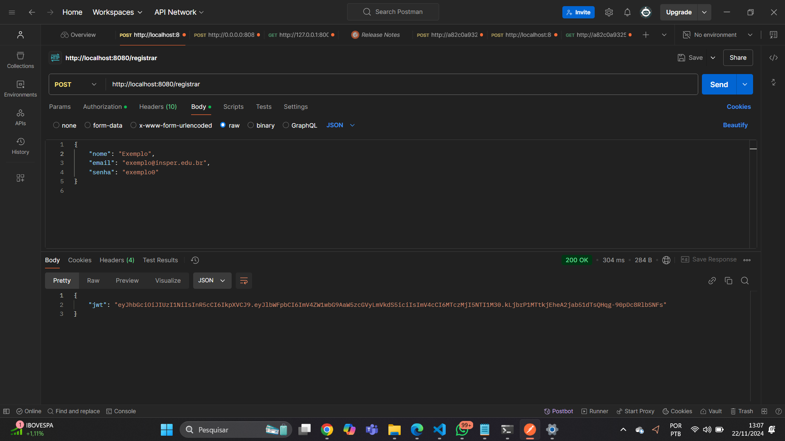

# Endpoint: POST /registrar

Registra um novo usuário na API.

### **Método**
`POST`

### **URL**
`/registrar`

### **Cabeçalho**
`http://localhost:8080/registrar`

## **Requisição**
```json
{
    "nome": "Computação em Nuvem Humberto",
    "email": "HumbertoNuvem@insper.edu.br",
    "senha": "nuvem0"}
```
